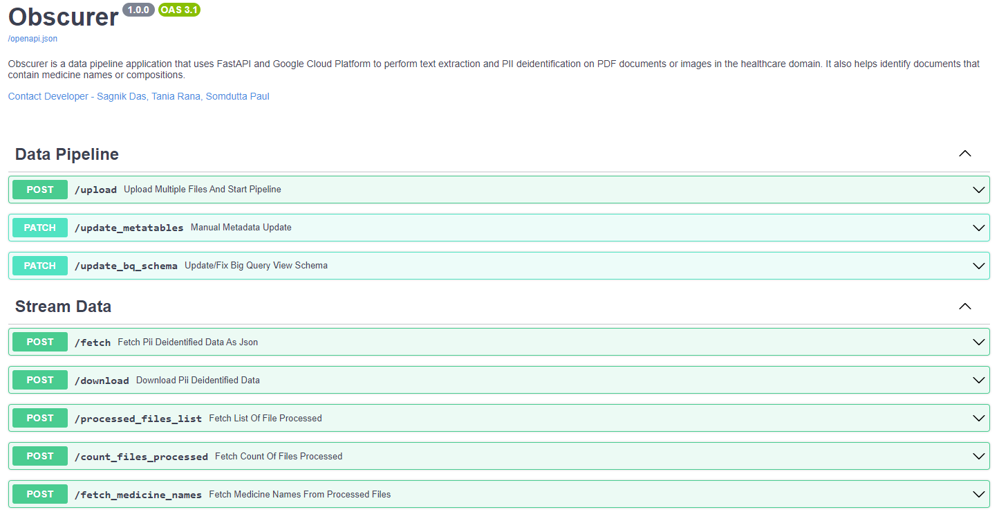

# Obscurer
Obscurer is a data pipeline application that uses FastAPI and Google Cloud Platform to perform text extraction and PII deidentification on PDF documents or images in the healthcare domain. It also helps identify documents that contain medicine names or compositions.

## Features
- Upload PDF documents or images related to healthcare to Google Cloud Storage
- Extract text from PDF documents or images using Google Cloud Documents AI
- Deidentify PII (such as patient names, medical records, insurance numbers, etc.) from the extracted text using Google Cloud DLP API
- Analyze entities and entity sentiments from the deidentified text using Google Cloud Natural Language API
- Identify medicine names or compositions from the entities using a custom dictionary
- Store the results in Google BigQuery tables
- Query the results using a FastAPI web service

## How to use
- Clone this repository to your local machine
- Create a Google Cloud project and enable the required APIs (Documents AI, DLP, Natural Language, BigQuery, App Engine)
- Set up authentication using a service account and a service account key
- Configure the environment variables in the .env file
- Run the main.py script to start the data pipeline
- Visit the web service URL to upload documents and query results

## Installation
To install the required dependencies and setup App Engine environment, run the following command in your terminal:

```bash
git clone https://github.com/sagnik-sudo/Obscurer.git
cd Obscurer/
python -m venv ./env
gcloud config set project <PROJECT_ID>
source env/bin/activate
pip install -r requirements.txt
gcloud app deploy --no-cache -v 2
gcloud app logs tail -s default
```


## Authentication

The `gcloud auth login` command can authorize access with a service account by using a credential file stored on your local filesystem. This credential can be either a credential configuration file for workload identity federation or a service account key.

#### Authorize a service account using workload identity federation
To authorize the gcloud CLI with a service account using external credentials from workload identity federation, do the following:

1. In the Google Cloud console, go to the Service Accounts page.

    [Go to Service Accounts](https://console.cloud.google.com/iam-admin/serviceaccounts)

2. Choose an existing account or create a new account by clicking Create service account.

3. [Create a credential configuration file for workload identity federation](https://console.cloud.google.com/iam-admin/serviceaccounts) by following the directions for your supported identity provider.

4. To activate your service account, run gcloud auth login with the --cred-file flag:

    ```bash
    gcloud auth login --cred-file=creds.json
    ```

## Running the code
### Development environment

To run the code in a development environment, use Uvicorn as follows:

```bash
python -m uvicorn main:app --reload --port 7777
```

This will start a local server at `http://127.0.0.1:7777`. You can access the interactive documentation at `http://127.0.0.1:7777`.

To test the application, you can use the curl command or any HTTP client. For example:

```bash
curl -X 'POST' \
  'http://127.0.0.1:7777/upload-file/' \
  -H 'accept: application/json' \
  -H 'Content-Type: multipart/form-data' \
  -F 'file=@plan.png;type=image/png'
```

This will upload your file to the server and return a JSON response with the deidentified text.

### Production environment
To run the code in a production environment, you can deploy it to Google App Engine using the following steps:

- Create an app.yaml file in your project directory with the following content:
```yaml
runtime: python39
entrypoint: uvicorn main:app --host=0.0.0.0 --port=${PORT:-8080}

handlers:
- url: /.*
  script: auto
```
- Run the following command to deploy your app:

```bash
gcloud app deploy
```

This will create a URL for your app, such as `https://your-project-id.appspot.com.`

To test the application, you can use the same curl command or any HTTP client as before, but with the new URL.

## Miscelleanous
### Swagger UI

### Project Pipeline


## License
This project is licensed under the GNU General Public License v3.0 - see the LICENSE file for details.