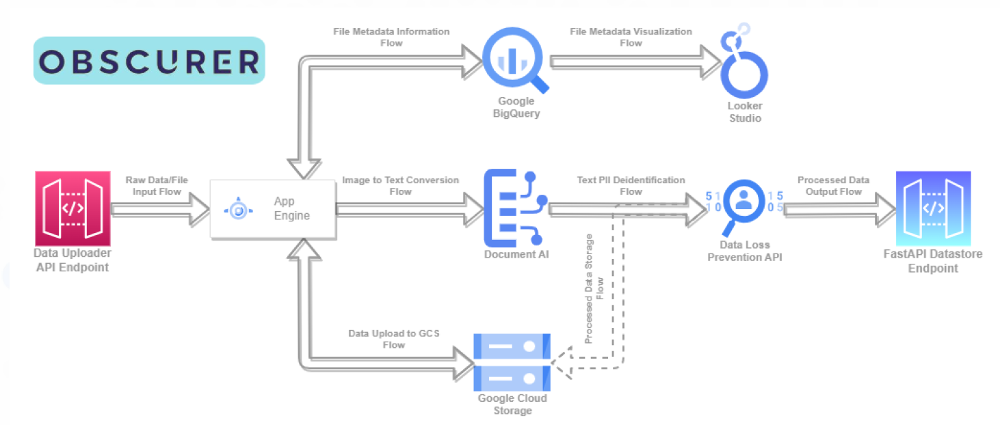

# Casadona Warriors Hackathon
This project is a FastAPI application that takes image, pdf, or docx files as input and converts them to a readable text file, then applies PII (Personally Identifiable Information) deidentification and finally gives that as the output to the user.

## Installation
To install the required dependencies, run the following command in your terminal:

```pip install -r requirements.txt```

This will install FastAPI, Uvicorn, PyTesseract, pdf2image, docx2txt, and google cloud modules.

## Authentication

The `gcloud auth login` command can authorize access with a service account by using a credential file stored on your local filesystem. This credential can be either a credential configuration file for workload identity federation or a service account key.

#### Authorize a service account using workload identity federation
To authorize the gcloud CLI with a service account using external credentials from workload identity federation, do the following:

1. In the Google Cloud console, go to the Service Accounts page.

    [Go to Service Accounts](https://console.cloud.google.com/iam-admin/serviceaccounts)

2. Choose an existing account or create a new account by clicking Create service account.

3. [Create a credential configuration file for workload identity federation](https://console.cloud.google.com/iam-admin/serviceaccounts) by following the directions for your supported identity provider.

4. To activate your service account, run gcloud auth login with the --cred-file flag:

    ```gcloud auth login --cred-file=creds.json```

## Running the code
### Development environment

To run the code in a development environment, use Uvicorn as follows:

```python -m uvicorn main:app --reload --port 7777```

This will start a local server at `http://127.0.0.1:7777`. You can access the interactive documentation at `http://127.0.0.1:7777`.

To test the application, you can use the curl command or any HTTP client. For example:

```
curl -X 'POST' \
  'http://127.0.0.1:7777/upload-file/' \
  -H 'accept: application/json' \
  -H 'Content-Type: multipart/form-data' \
  -F 'file=@plan.png;type=image/png'
```

This will upload your file to the server and return a JSON response with the deidentified text.

### Production environment
To run the code in a production environment, you can deploy it to Google App Engine using the following steps:

- Create an app.yaml file in your project directory with the following content:
```
runtime: python
env: flex
entrypoint: gunicorn -w 4 -k uvicorn.workers.UvicornWorker main:app

handlers:
- url: /.*
  script: auto

runtime_config:
  python_version: 3
```
- Run the following command to deploy your app:

```gcloud app deploy```

This will create a URL for your app, such as `https://your-project-id.appspot.com.` You can access the interactive documentation at `https://your-project-id.appspot.com/docs`.

To test the application, you can use the same curl command or any HTTP client as before, but with the new URL.

## Miscelleanous
### Swagger UI

### Project Pipeline


## License
This project is licensed under the GNU General Public License v3.0 - see the LICENSE file for details.